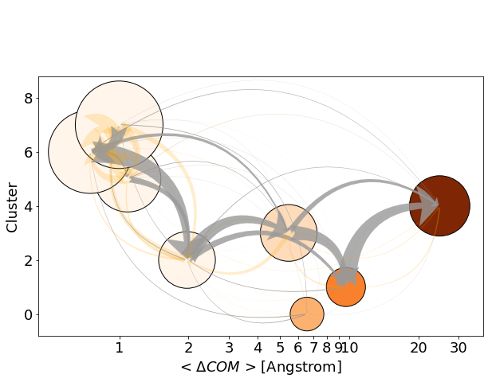

# A Python Workflow for the Generation and Analysis of Protein-Ligand Interaction Fingerprints from Molecular Dynamics trajectories
## This is a collection of examples showing how to carry out particular tasks using MD-IFP scripts
### v.1.1
### 19.06.2021

## Tutorials: 
1. Youtube lecture/tutorial for 2020 MolSSI School on Open Source Software in Rare Event Path Sampling Strategies: "tauRAMD workflow: fast estimation of protein-ligand residence times with insights into dissociation mechanisms" : https://www.youtube.com/watch?v=kCUyQtoo4cE&feature=youtu.be

## Authors and Contributors:

* Daria Kokh
* Fabian Ormersbach - preprocessing PDB files using Chimera (Process_pdb.py, chimera_hydrogen_mol2.py; test examples revised) 

Heidelberg Institute of Theoretical Studies (HITS, www.h-its.org)

Schloss-Wolfsbrunnenweg 35

69118 Heidelberg, Germany

## Scripts:

__Trajectories.py__  - Functions for building a trajectory object for reading and analysis of standard MD and RAMD trajectories and computation of relative residence times

__IFP_generation.py__  - Functions for generation of IFPs

__Clustering.py__   - Functions for analysis of trajectories using IFP data

__Process_pdb.py__   - Preprocessing PDB files (splitting into ligand and protein files)

__chimera_hydrogen_mol2.py__  - Generation of ligand mol2 file 

__IFP_preprocess_Gromacs.py__  - Enables wrapping a system back into the original box using trjconv Gromacs tool. Script is designed for a specific file structure - please adjust accordingly. The script helps to transform system back into the box in the most but not in 100% of cases. For example it does not prevent splitting two proteins in the case of protein-protein complexes 

__IFP_contacts_quickView.py__ - Visualization of computed IFPs (from pkl files containing IFPs)
       
__IFP.py__ - Generation of the IFP databease for a single MD trajectory (obtained either from standard MD or RAMD) of a protein-ligand complex.

## Test Examples as Python Jupyter Notebooks :

### Data employed in test examples I-IV
   can be downloaded from  https://zenodo.org/record/3981155#.XzQEUCgzaUk

### I. __IFP_generation_PDB_single_traj.ipynb:__

Protein-Ligand Interaction Fingerprint (IFP) computations (only functions of IFP_generation.py are used) for:
   1. a single structure prepared for MD simulations (HSP90; PDB ID 6EI5, dcd format)
   2. a trajectory (for selected frames; dcd format)
   3. a PDB structure

### II. __IFP_generation_multiple_traj_GPCR.ipynb:__ 

Generation and analysis of IFPs for conventional MD simulations and for RAMD trajectories for Muscarinic Receptor M2 in a membrane. In this example, __Trajectories.py__ is used for pre-processing trajectories and __IFP_generation.py__ is used for computing IFPs:
   1. Computing IFPs for a single equilibration trajectory (dcd format)
   2. Computing IFPs for a set of trajectories: system equilibration and ligand dissociation (RAMD) trajectories (dcd format)

*Illustration of PL IFP variation in one of the dissociation trajectories of iperoxo bound to muscarinic receptor M2.*

### III. __IFP_analysis_RAMD_HSP90.ipynb:__ 

This example shows how RAMD dissociation trajectories can be analyzed using pre-generated IFP databases.

*This plot illustrates ligand dissociation pathways in a graph representation derived from clustering RAMD PL trajectories in IFP space and plotting them with respect to the ligand COM from the initial bound position.*
   
### IV. __IFP_generation_multiple_PDB_HSP90.ipynb:__

JN designed for validation of the IFP sctipt on 40 PDB complexes (used in paper J. Chem. Phys. 2020, doi: 10.1063/5.0019088)

*Validation of PL IFP on 40 PDB structures:*
   - false positives (FP) if no other method (FLIP, PLIP, LPC, MOE) was able to find them 
   - false negative (FN) if all four (three for water bridges and halogen bonds) found the missing interaction.
   - true positives (TP) if at least one method (FLIP, PLIP, LPC, MOE) was able to find it

### Data employed in test example V
   can be downloaded from https://zenodo.org/record/5001884#.YM-rRmgzYuU
      
### V. __IFP_analysis_RAMD_GPCR.ipynb:__

JN for post-processing RAMD trajectories and explore dissociation mechanisms of ACh-M2, IXO-M2, IXO-PAM-M2 and ALO-β2AR. This JN uses pre-generated IFP databases.
This JN was made to be run on EBRAINS, to run it on Google Colab directly click on the __Open in Colab__ button.

### For running on an [ebrains](https://wiki.ebrains.eu/bin/view/Main/) account
Please start a [lab session](https://lab.ebrains.eu/) and upload the above jupyter notebook in your space.
Then use the MD-IFP analysis to get the [Dissociation mechanisms from M2 and β2 adrenergic receptors](./Examples-JN/IFP_analysis_RAMD_GPCR.ipynb)
###  Note: This jupyter notebook is part of the tutorial for getting residence time and exploring dissociation mechanisms of GPCRs.
To also perform the first part, from the [tauRAMD repository](https://github.com/HITS-MCM/tauRAMD) use the first part to get the residence times [1st_tutorial_tauRAMD-residencetime-ebrains.ipynb](https://github.com/HITS-MCM/tauRAMD/blob/master/1st_tutorial_tauRAMD-residencetime-ebrains.ipynb)

